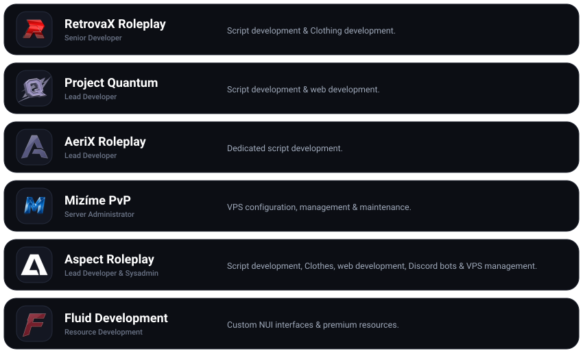

<h1 align="center">👋, I'm nyxo</h1>

<h3> Developer</h3>

  

---

<h3> About Me</h3>

   &nbsp;Hey, I'm <b>nyxo</b> — Full Stack Web & FiveM Developer based in the <b>Czech Republic</b> 
   &nbsp;Focused on crafting <b>high performance scripts</b>, clean <b>NUI interfaces</b> & modern web apps 
   &nbsp;Always open to <b>new projects</b> & new ideas <i>feel free to reach out!</i>

  
<i>My current activity</i>

   
  

    
  

---

<h4 align="center"> Languages</h4>

  

<h4 align="center"> Frameworks & Environment</h4>

  
    
  

---

  

---

<h3> My Projects</h3>

  

